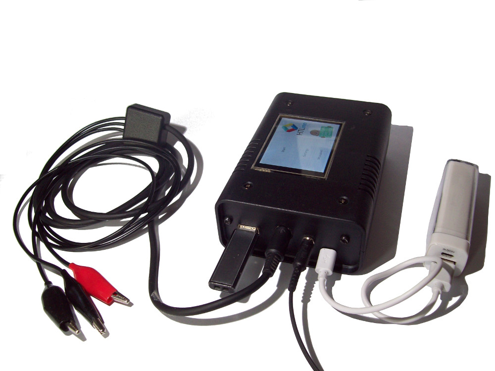
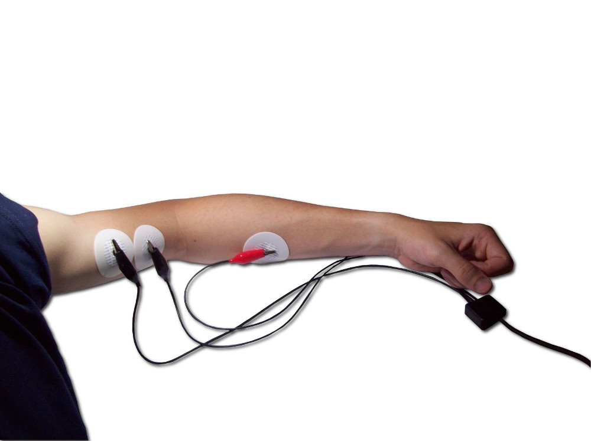
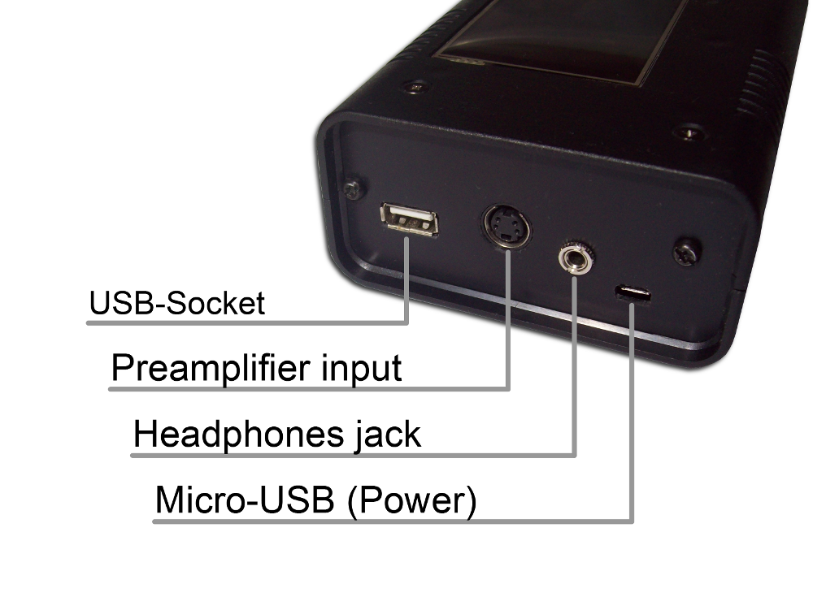

# EMG-muscle-therapy-device

Firmware for EMG muscle therapy device used by the NGO "A chance for children"
helping children to recover after muscle injuries (using electromyography) 

Find a description [here](https://github.com/simonkaufmann/EMG-muscle-therapy-device/blob/master/manual/manual_emg_muscle_therapy_device.pdf)

## Pictures

Finished device:  

Software:  

Electrodes attached:  

Device connections:  

